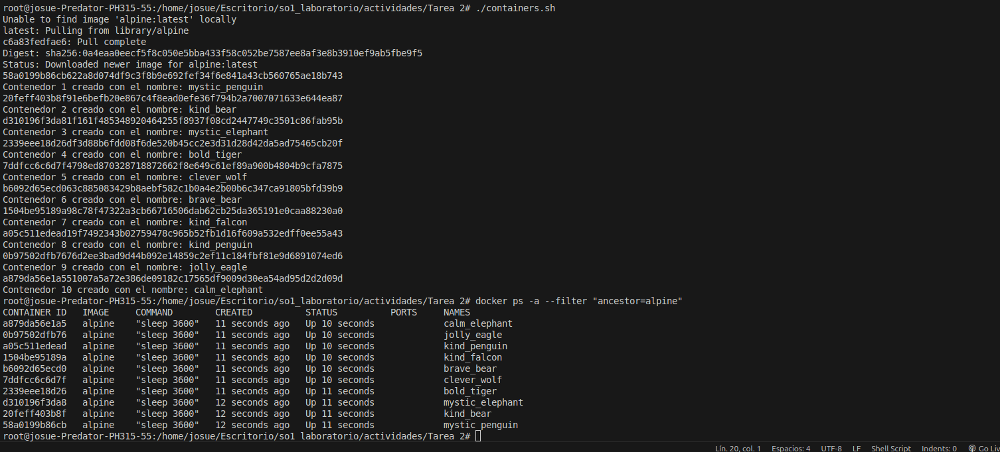

# Script
```bash
#!/bin/bash

# Función para generar nombres aleatorios
generate_random_name() {
  local ADJECTIVES=("mystic" "bold" "fancy" "brave" "calm" "clever" "gentle" "happy" "jolly" "kind")
  local ANIMALS=("panda" "tiger" "elephant" "penguin" "whale" "lion" "wolf" "bear" "eagle" "falcon")
  
  # Genera un nombre combinando un adjetivo y un animal aleatorio
  local RANDOM_NAME="${ADJECTIVES[$RANDOM % ${#ADJECTIVES[@]}]}_${ANIMALS[$RANDOM % ${#ANIMALS[@]}]}"
  
  echo $RANDOM_NAME
}

# Crear 10 contenedores con nombres aleatorios
for i in {1..10}; do
  NAME=$(generate_random_name)
  docker run -d --name $NAME alpine sleep 3600
  echo "Contenedor $i creado con el nombre: $NAME"
done

```

# Contenedores

## Listar contenedores
Solo los creados con la imagen de Alpine
```bash
docker ps -a --filter "ancestor=alpine"
```
Todos los contenedores
```bash
sudo docker ps -a
```
## Eliminar contenedores
Primero los detenemos
```bash
sudo docker stop $(sudo docker ps -q)
```

Eliminar un contenedor individualmente
```bash
sudo docker rm nombre_del_contenedor
```
Eliminar en conjunto
```bash
sudo docker rm $(sudo docker ps -a -q --filter "ancestor=alpine")
```
